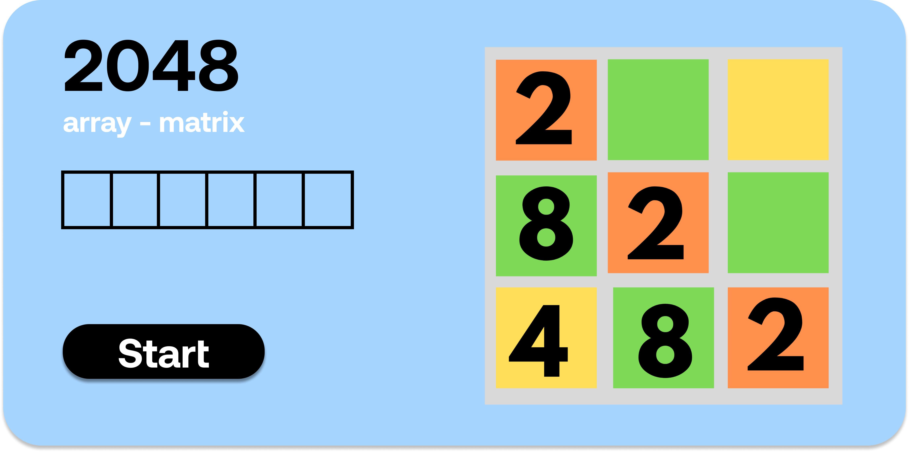

# Array - 2048

<p align="center">
  
</p>


This project is well known game named 2048 in which mostly the array data-structure is used.

# How to run app 

 * This is simple website with vanila javascript so you can directly run on your local machine without downloading any additional framework.
 * If you want to edite then it is better to use sass compiler because scss is used here. 

# How to run modules

 * You don't need to press any button just open game and play with your keyboard with arrow keys.

# How it works

```sh

Array - 2048

-> play audio
    -> plays audio for background sound 
-> key press
    -> it's event which take action according to key press
    -> press down -> down
    -> press up -> up
    -> press left -> left
    -> press right -> right
-> create board
    -> creates blank board [nxn] filled with  0's
-> generate random
    -> generates random number in blank board
-> is_2048
    -> checks if there is 2048 in the board
    -> if there is 2048 then player win the game
-> fill board canvas
    -> use [nxn] matrix and print that to screen with different color
-> up
    -> up work
        -> traverse array and sum if psbl acc to down->top
    -> generate random
        -> generate random value in board
    -> combine column left
        -> combine the columns if psbl
    -> fill board canvas    
        -> fill the new board
-> down
    -> down work
        -> traverse array and sum if psbl acc to top->down
    -> generate random
        -> generate random value in board
    -> combine column right
        -> combine the columns if psbl
    -> fill board canvas    
        -> fill the new board        
-> left
    -> left work
        -> traverse array and sum if psbl acc to right->left
    -> generate random
        -> generate random value in board
    -> combine row left
        -> combine the row if psbl
    -> fill board canvas    
        -> fill the new board     
-> right
    -> right work
        -> traverse array and sum if psbl acc to left->right
    -> generate random
        -> generate random value in board
    -> combine row right
        -> combine the row if psbl
    -> fill board canvas    
        -> fill the new board     

```

## What it looks like


<p align="center">
  
</p>
  
