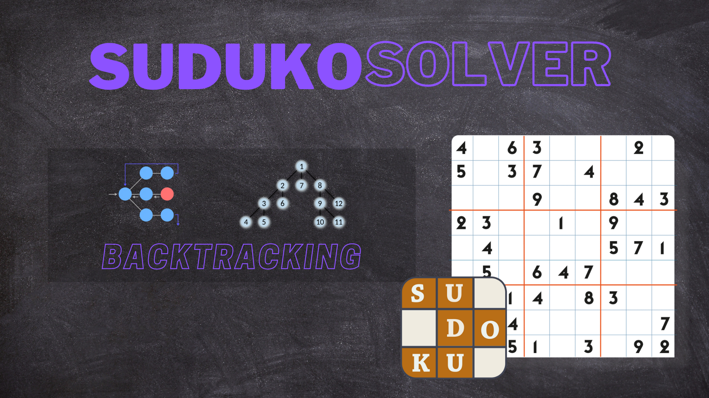
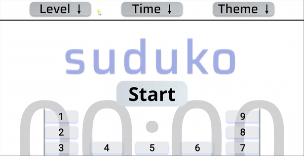

# Recursion and Backtracking - Suduko Solver

<p align="center">
  
</p>


This project is suduko game which uses recursion and backtracking and in each step it checks wheather the number is safe or not.


# How to run app 

 * This is simple website with vanila javascript so you can directly run on your local machine without downloading any additional framework.
 * If you want to edite then it is better to use sass compiler because scss is used here. 

# How to run modules

 * Select level, theme and time according to your preference and start the game by pressing start button.
 * select number and put that number in cell by clicking cell.
 * If you stuck than use get solution button to know solution.

# How it works

```sh
Recursion and Backtracking - Suduko Solver

    Game basic class
        - constructor 
            - level (easy,medium,hard)
        - set timer
            - set and start timer to screen
        - create board display
            - create board by given size and display to screen
        - not selected default 
            - it returns the cell  if it is not filled
        - rem extra from nav
            - it removes items from navbar
        - is game end
            - it checks is all cell is filled successfully or not 
        - show duplicate
            - it shows the duplicate number cell in x color so that one number repeat in any row,col or box    
        - is safe
            - return true if number is safe in  that cell 
            - safe by col(), row(), box()
        - is row safe()
            - checks the number in row is safe
        - is col safe()
            - checks the number in col is safe
        - is box safe()
            - checks the number in box is  safe
        - get board by level 
            - by level the board is different so it get's the board by level
        - set globals
            - it simply set the global variables
        - make default value 
            - this function makes the the already filled cell default so that no one can change it's value
    start 
        - when game start then this function is called
        - set level, time ,theme
        - remove button and other items
        - set timer
    cell choosen action 
        - if cell is choosen and if number is safe then display to cell
        - if number is not safe then show other duplicate with x color
    Get solution class  
        - constructor 
            - board , board-size, grid-size
        - suduko solver 
            - if number is safe in cell then put 
            - else backtrack and fill again 0 to that cell 
            

```

## What it looks like


<p align="center">
  
</p>
  
