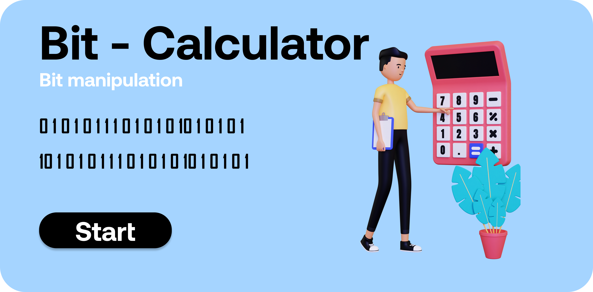
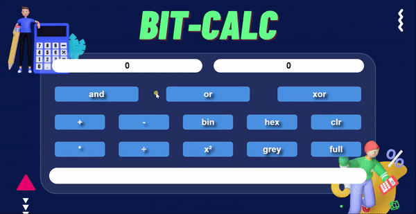

# Bit Manipulation - Bit Calculator

<p align="center">
  
</p>


This project is simple calculator with different functionalities the unique feature in this project is there is no math sign('+','-','*','/') is used here instead of this sign the bit manipulation is used.


# How to run app 

 * This is simple website with vanila javascript so you can directly run on your local machine without downloading any additional framework.
 * If you want to edite then it is better to use sass compiler because scss is used here. 

# How to run modules

 * In this module just enter value-one in one input field and enter value-two in second input field.
 * press the button according to the action you want to perform the result is shown to the result field.

# How it works

```sh
Bit Manipulation - Bit Calculator

    play audio
        - play sound in while pressing any button
    set first value
        - set first value 
    set second value 
        -sets second value  
    set input num1
        - set the value to input field1
    set input num2
        - set the value to input field2
    get input num1
        - return the value of input field1
    get input num2
        - return the value of input field2
    reset input field
        - clear the input fields
    set output
        - set the output value to output field
    get left
        - left shift by 1
    get right 
        - right shift by 1
    clear value 
        - set value 0 (value & 0) to input field1 and 2 and output field
    full 
        - set max value(value | 0xff) for 8 bit to input field1 and 2 and output field
    get and 
        - return first value & second value
    get or 
        - return first value | second value
    get xor 
        - return first value ^ second value
    and action 
        - set both value    
        - perform and operation
        - set output vlaue
    or action 
        - set both value    
        - perform or operation
        - set output vlaue
    xor action 
        - set both value    
        - perform xor operation
        - set output vlaue
    binary 
        - get both value 
        - find binary of both 
        - set output value
    plus 
        - get both value 
        - add both value (without + sign)
        - set output
    mul 
        - get both value 
        - multiply both value (without * sign)
        - set output
    minus 
        - get both value 
        - value1 - value 2 (without - sign)
    square 
        - get both value
        - left shift
        - set output
    grey 
        - take both value 
        - convert to grey code
        - set output
    div 
        - get both value    
        - division of both value (without / sign)
        - set output
    hexa 
        - get both value 
        - convert to hexadecimal value 
        - set output


```

## What it looks like


<p align="center">
  
</p>
  
