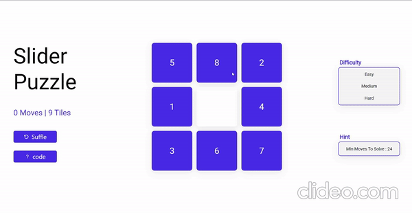

# BFS - SLIDING PUZZLE

<p align="center">
  
</p>


This project is sliding puzzle game in which we have to move the tile to increasing sequence. With the help of graph and bfs algorithm the project or game is able to tell minimome moves required to solve the puzzle if you got try some other moves  it means either there is no possible moves or the possible moves you will see after moving some tile. In each move the algo has to check what is min moves so the complexity is very high and that's why you see lagging sometimes.


# How to run app 

 * This is simple website with vanila javascript so you can directly run on your local machine without downloading any additional framework.
 * If you want to edite then it is better to use sass compiler because scss is used here. 

# How to run modules

* You don't need to press any button just handle controls with your keyboard's arrow keys.
* If you want to Shuffle the tiles then click shuffle or choose the difficulty level.
* Consider the hint which is shown in hint section and take help to solve the puzzle.
* Enjoy the game and solve the game in minimum moves.


# How it Works
sh
```

```

  
