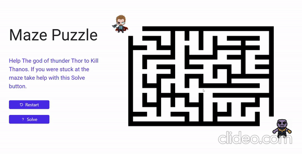

# DFS - MAZE SOLVER

<p align="center">
  
</p>
  


This project is maze solving game in which we have to move the hammer from top left corner to bottom right corner . With the help of graph dfs algorithm the new functionality added where by clicking the solve button you are able to get the path from your current position to goal.


# How to run app 

 * This is simple website with vanila javascript so you can directly run on your local machine without downloading any additional framework.
 * If you want to edite then it is better to use sass compiler because scss is used here. 

# How to run modules

* You don't need to press any button just handle controls with your keyboard's arrow keys.
* Whenever you stuck in any position use solve button and get your path.


# How it Works
sh
```

```


