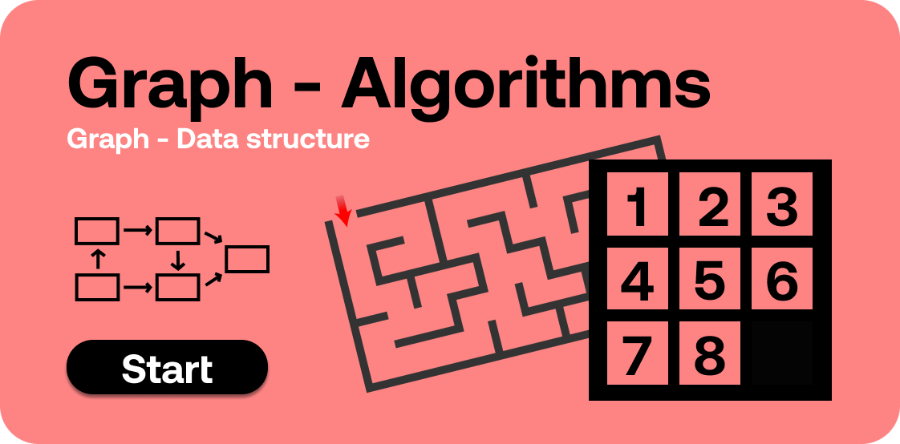
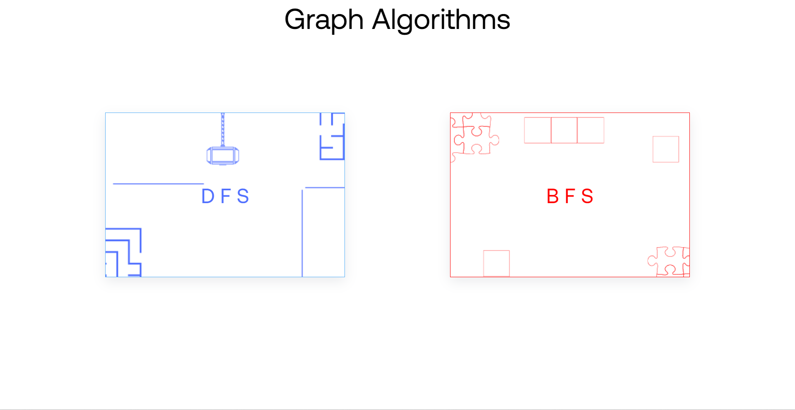

# Graph - Graph algorithms

  

This project is well known simple popular games with some additional functionality. This functionality involves graph algorithms like bfs and dfs.
# How to run app 

 * This is simple website with vanila javascript so you can directly run on your local machine without downloading any additional framework.
 * If you want to edite then it is better to use sass compiler because scss is used here. 

# How to run modules

* You don't need to press any button just handle controls with your keyboard's arrow keys.
* Check your score on score board and if game ends then press restart button to play again.

# Sub Project Links 
* [DFS - Maze Solver](https://github.com/aditya-2703/DSA-HUB/tree/main/GRAPH/DFS)
* [BFS - Sliding Puzzle](https://github.com/aditya-2703/DSA-HUB/tree/main/GRAPH/BFS)

## What it looks like

  

  
