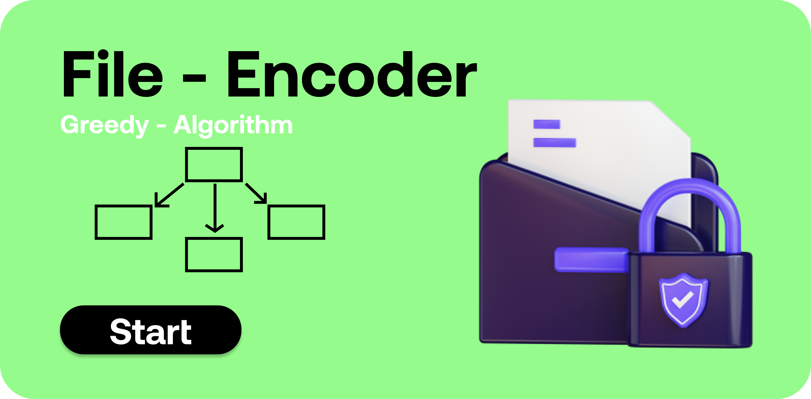

# Greedy - File Encoder

<p align="center">
  
</p>


This project is an file encoder which uses huffman encoding to encode the text. This algorithm reduces the size of text around 34% from actual size. this algorithm falls under greedy category. 

# How to run app 

 * This is simple website with vanila javascript so you can directly run on your local machine without downloading any additional framework.
 * If you want to edite then it is better to use sass compiler because scss is used here. 

# How to run modules

 * You just need to give text in input field and press the button according to your preference and boom it's done.

# How it works

```sh

Greedy - File Encoder

class node 
    - value 
    - freq
    - left
    - right

class Huffman
    -> constructor
        - for encoding string
        - text - given string as input
        - heap - used for algorithm
        - code - maping of code with character
        - char_list - maping of character with its frequency
        - reverse_code - reverse maping of code for decoding purpose
    -> make_char_freq
        - creating maping of char with freq
    -> fill_heap
        - adding values in heap
    -> make_heap_node
        - convert this heap nodes into tree
    -> make_tree
        - return tree
    -> make_code
        - create maping of code with character
    -> make_text
        - create encoded text
    -> padding_text
        - attach padding if needed
    -> encoded_text
        - create binary string to 8-bit value and pushed in array
    -> make_reverse_code
        - create reverse code maping
    -> compress
        - main method which call all the above method and return encoding string

class Decoding
    -> constructor
        - initialize reverse_code maping
    -> remove_padding
        - removes padding if so
    -> decode_string
        - takes normal string and return decoding string
    -> get_char_code
        - returns the encoded text from string 
    -> decompress
        - main method which call all the above method and return decoding string
bytesToSize()
    - takes bytes as input return size of it in kb,mb

set_value()
    - set given value to field

encoding()
    - takes string from field and encode then display to screen

decoding()
    - takes encoded string decode it and display to screen


```
## What it looks like


<p align="center">
  
</p>
  
