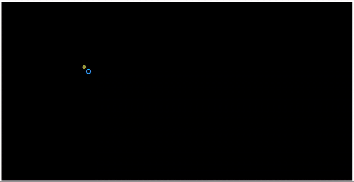

# Greedy - File Encoder

<p align="center">
  
</p>


This project is an file encoder which uses huffman encoding to encode the text. This algorithm reduces the size of text around 34% from actual size. this algorithm falls under greedy category. 

# How to run app 

 * This is simple website with vanila javascript so you can directly run on your local machine without downloading any additional framework.
 * If you want to edite then it is better to use sass compiler because scss is used here. 

# How to run modules

 * You don't need to press any button just open game and play with your keyboard with arrow keys.

# How it works

```sh

Greedy - File Encoder

```
## What it looks like


<p align="center">
  
</p>
  
