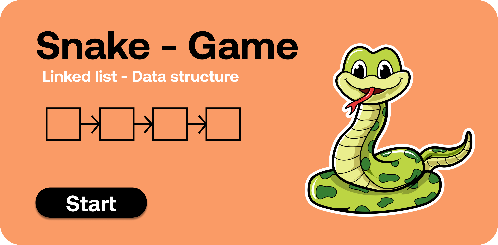
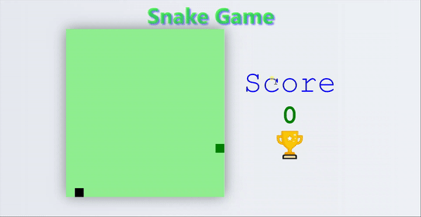

# Linked List - Snake Game

<p align="center">
  
</p>


This project is well known snake game which we play in nokia old phone which is so popular at that time.
# How to run app 

 * This is simple website with vanila javascript so you can directly run on your local machine without downloading any additional framework.
 * If you want to edite then it is better to use sass compiler because scss is used here. 

# How to run modules

* You don't need to press any button just handle controls with your keyboard's arrow keys.
* Check your score on score board and if game ends then press restart button to play again.

# How it works

```sh

- board [matrix || array ]
- food 
    - inital at random location 
    - snake it then also goes to random location
- snake
   - Draw class
        - draw the element to screen
        - constructor - snake obj
        - reset board
            - clears the board by removing all the elements food and snake 
        - draw
            - draw the snake in some x color
    - Controls class
        - constructor - left
            - left - when left arrow key pressed - call left()
            - right - when right arrow key pressed - call right()
            - up - when up arrow key pressed - call up()
            - down - when down arrow key pressed - call down()
    - Node class
        - represent single node 
            - data
            - next
    - Snake class
        - constructor - 
            - start - points to head of list
            - tail - points to tail of list
            - node - points to new node
            - snake size - size of linked list
        - movement 
            - if there is only one node just move that node by reassigning the address
        - grow snake
            - if snake eat food (list head touches the food location) add node
        - check snake status 
            - update score and show to screen
        - add beg
            - add node to begining of list
        - rem end
            - remove node from end of list
        - add end 
            - add node to end of list
        - rem beg 
            - remove node from begining
        - move left
            - if only one node just move address(-1)
            - else 
                - add begining
                - remove end
        - move right 
            - if only one node just move address(+1)
            - else 
                - add end
                - remove beg
        - move up 
            - if only one node just move address(-18)
            - else 
                - add beg
                - remove end
            - check the dirrection of snake is it right or left
        - move down
            - if only one node just move address(+18)
            - else 
                - add beg
                - remove end
            - check the dirrection of snake is it right or left
    - snake pos random
        - return random position 
    - fill food 
        - set food to random position 
    - Create board class 
        - create grid of AxA size
    - game end 
        - perform operation on game ending
    - is out of boundry 
        - if player touches boundry then game end
        
```

## What it looks like


<p align="center">
  
</p>
  
