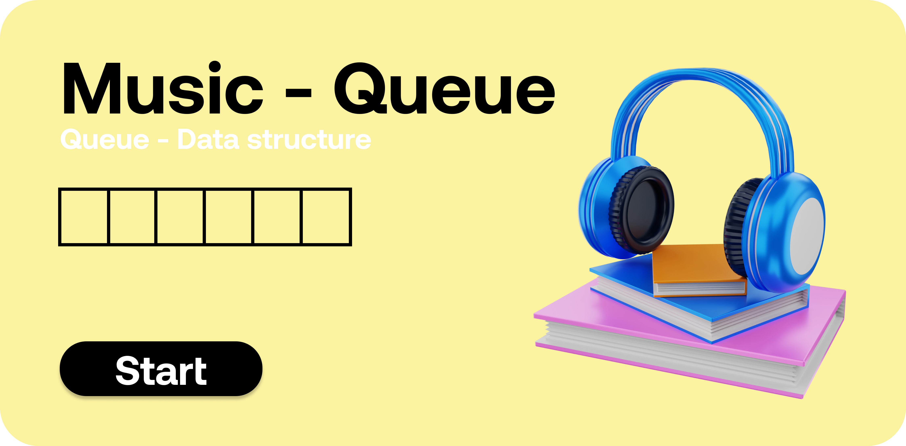
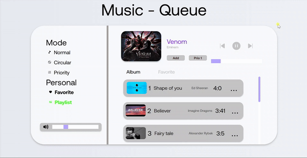

# Queue - Music Queue

<p align="center">
  
</p>

In this project i build music player with help of queue data structure and as feature i provide different type of queue like circular queue, priority queue and normal queue.
User can also add his/her priority to the song and add to favorite list so he/she can play music based on his/her priority.

# How to run app 

 * This is simple website with vanila javascript so you can directly run on your local machine without downloading any additional framework.
 * If you want to edite then it is better to use sass compiler because scss is used here. 

# How to run modules

 * You just need to select song from playlist or favorite section and play the song.
 * in circular mode the after last song is played you can jump to the first song.
 * in priority mode the song's can played  by it's priority which you provided.
 * You can also add song to favorite list.
 * Adjust volume by the slider which is given to bottom left corner. 

# How it works

```sh

Queue - Music Queue

Mode 
    - normal 
        - normal queue fifo
    -circular 
        - circular queue
    -priority
        - priority queue

Working 
    - show to screen 
        - take array of object and show it to the screen 
        - Data
            - id (num)
            - name (str)
            - artist name (str)
            - priority (num)
            - path (song path)
            - image(artist)
            - time(song time)
    - on mode select
        - normal 
            - play songs(favorite or album) in simple fifo manner
        - circular 
            - play song(favorite or album) in circular manner
        - priority 
            - play song(favorite or album) in priority manner using heap
    - set next song / set prev song
        - find the mode take action acc to that 
    - add to priority 
        - take that object by id and change it's priority
    - add to favorite
        - take that song check is not duplicate and add to favorite list
    - set current song
        - set current song to screen
    - show favorite / show album
        - show entire list of obj to screen
    - volume change 
        - volume change acc to onchange slider

```

## What it looks like


<p align="center">
  
</p>
  
