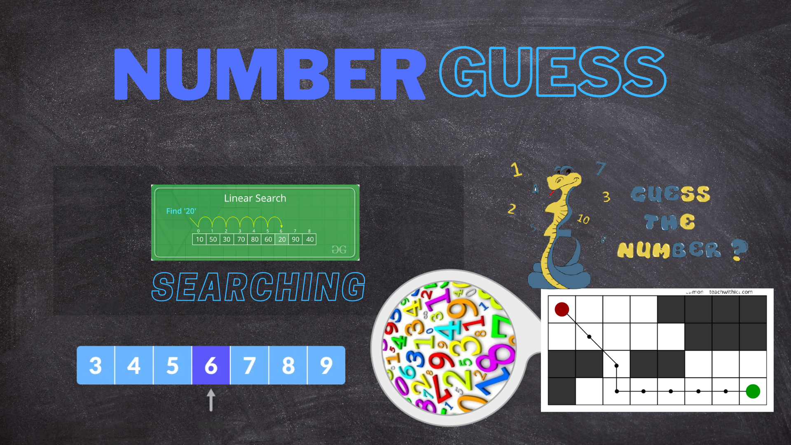
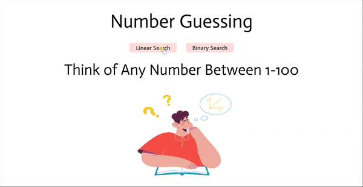

# Searching - Number Guessing

<p align="center">
  
</p>


This project is based on the game called number guessing where user think of any number between 1 - 100 and the program has to guess.
In this game i build to method binary search and linear search so that the programmer knows the difference by playing this game.
The steps also mentioned according to methods.

# How to run app 

 * This is simple website with vanila javascript so you can directly run on your local machine without downloading any additional framework.
 * If you want to edite then it is better to use sass compiler because scss is used here. 

# How to run modules

 * You just need to select one of the method of searching and game starts!
 * After game start give the answer according to your number!


# How it works

```sh
Searching - Number Guessing

methods 
    - linear Searching
    - binary Searching

start game 
    - starts game acc to your method
Basic game functions class
    - constructor
        - binary search object
        - steps
    - remove extra
        - remove unneccesory things
    - add options list 
        - add dialogboxes
    - remove options list
        - remove dialogboxes
    - on method select 
        - set method acc to user
    - setting main number
        - this method set number acc to methods linear(0) binary(50)
    -start game 
        - when game starts 
            - remove extra()
            - add options list()
            - setting main number()
    - game end 
        - when we guess the number 
        - show to screen the msg and steps which we taken to guess
    - query 
        - linear 
            - is your number less then curr number ? if yess (-1)
            - is this your number ? game end()
            - is your number greater then curr number ? if yess (+1)
        - binary
            - is your number less then curr number ? if yess (end = mid-1)
            - is this your number ? game end()
            - is your number greater then curr number ? if yess (start=mid+1)


```

## What it looks like


<p align="center">
  
</p>
  
