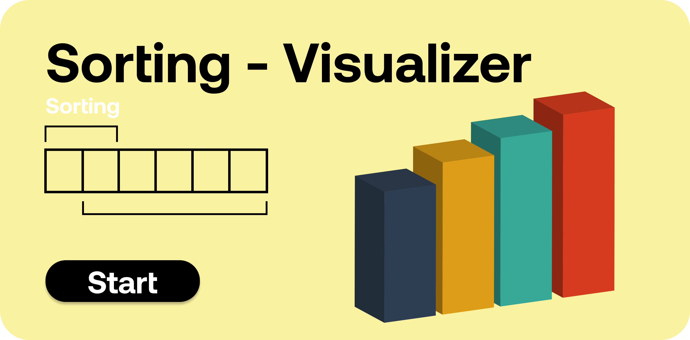

# Sorting - Sorting Visualizer

<p align="center">
  
</p>


This project is Sorting visualizer to understand how different sorting algorithms work this visualizer includes bubble-sort,selection-sort,insertion-sort,shell-sort,quick-sort,merge-sort sorting algorithms.

# How to run app 

 * This is simple website with vanila javascript so you can directly run on your local machine without downloading any additional framework.
 * If you want to edite then it is better to use sass compiler because scss is used here. 

# How to run modules

 * In order to start visualizer you have to press start button.
 * after pressing start select your algo and press go.
 * after pressing go button you can adjust the speed of visualizer and the size of bars low to high.
 * you can also randomize the bars anytime by pressing the randomize button.
 * After pressing start you can see visualizer of your algo.

# How it works

```sh
Sorting - Sorting Visualizer

    methods
        - bubble sort
        - selection sort
        - insertion sort
        - shell sort
        - quick sort
        - merge sort
    
    set algo 
        - set algo acc to user's selection
    game start 
        - remove unneccesory things from screen
    clear canvas
        - clear the canvas by removing items from it
    set algo heading 
        - set the heading based on method user selects
    reset bars
        - remove all bars from screen
    make bars
        - make bars to screen by taking size as parameter
    draw bars
        - display that bars which you build to screen
    go 
        - when user start the game
        - clear canvas()
        - set algo heading()
        - make bars()
    clean array
        - set array to perticular parameter
    change color 
        - changes color of that element 
    set time 
        - event which is trigger when user change the slider 
    set size    
        - event which is trigger when user change the size of bars
    set array color
        - set the colors of array
    randomize bars
        - reset bars and make new bars
    different sorting algo
        - take the bars
        - sort with time sleep and color change
    start Visualizer
        - clean array()
        - diable sliders()
        - turn on Visualizer acc to sorting algo

```

## What it looks like


<p align="center">
  
</p>
  
