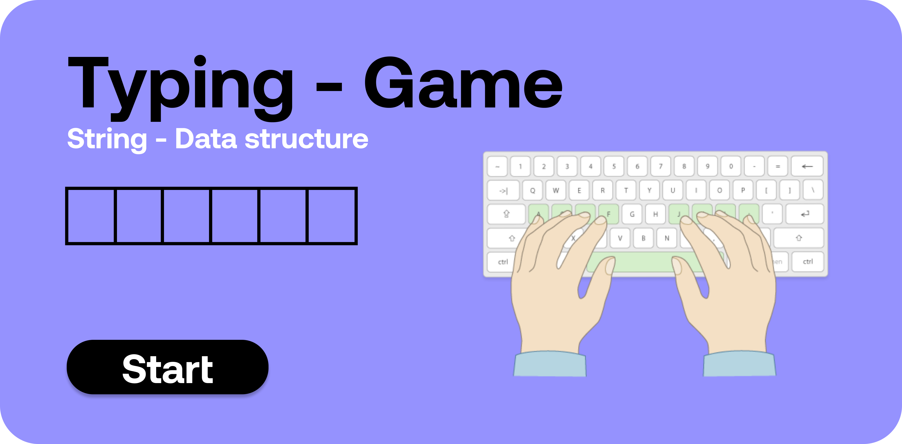

# String - Typing Game

<p align="center">
  
</p>


This project is Typing game which is used to imporve typing speed and build touch typing as a skill. here because we deal with strings so i build this using string data structure.

# How to run app 

 * This is simple website with vanila javascript so you can directly run on your local machine without downloading any additional framework.
 * If you want to edite then it is better to use sass compiler because scss is used here. 

# How to run modules

 * You just need to press start button and start typing on the input box.
 * timer starts running out.
 * after you finish the typing it tells your wpm score.

# How it works

```sh

String - Typing Game

game init 
    - when user press start button then game start
    - unnecessory thing removed  from screen
start timer
    - timer start so that we calculate wpm
make span
    - this function takes string and make each character a span so that we highlight each  
get data 
    - this function fetch random text from api (api mentioned below)
play 
    - this function play the song
word cont 
    - returns the each word count
event-listner input
    - when user types the keyword
    - it checks that char with string char and highlight according to it

api - https://baconipsum.com/api/?type=meat-and-filler    

```

## What it looks like


<p align="center">
  
</p>
  
